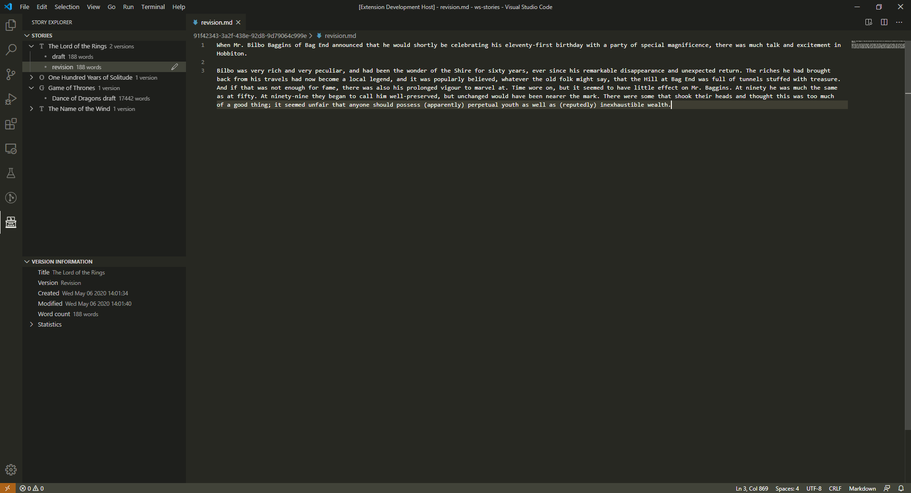

# Babel

Babel is a Visual Studio Code extension for writers and developers. It helps you manage your pieces and write without distractions, focusing on what really matters: your story. Using *versions*, you can keep track of your drafts, revisions, translations and submissions on Babel view. Upcoming features include backups of your stories in cloud storage providers, language statistics, exporting to custom manuscript formats and integration with [The Grinder](https://thegrinder.diabolicalplots.com/).

## Usage

1. Install Babel.
2. Create a folder to store your stories.
3. Open this folder with VSCode (either using the context menu in your file system explorer or directly from VSCode).
4. Click Babel icon in the activity bar to active the extension. Babel will ask you if you want to use the current folder to hold your stories. Choose yes.
5. Create a new story. A *draft* version will be automatically created.
6. Start writing.

## Settings

- `stories.workspace.removeFiles`: if set, the extension will also remove files when removing a story or a version from the workspace. Set with care.

## Upcoming features

- Integration with OneDrive, Google Drive and Dropbox to backup stories.
- Linguistic analysis of texts.
- Export to rtf, docx and pdf formats in common submission templates.
- Integration with *zen mode* in VSCode.
- Integration with [The Grinder](https://thegrinder.diabolicalplots.com/).
