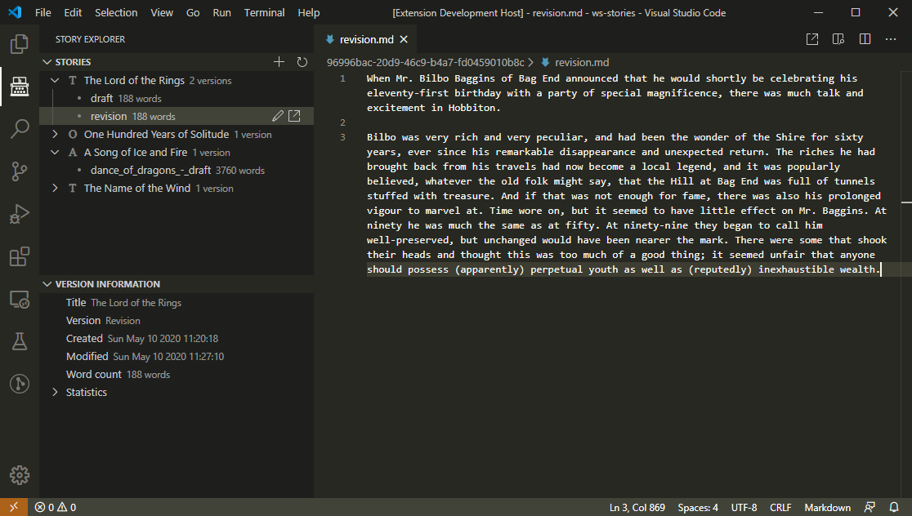
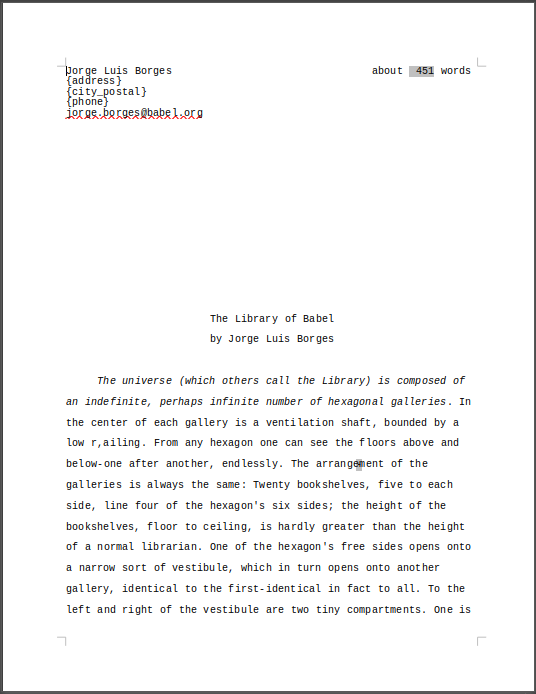
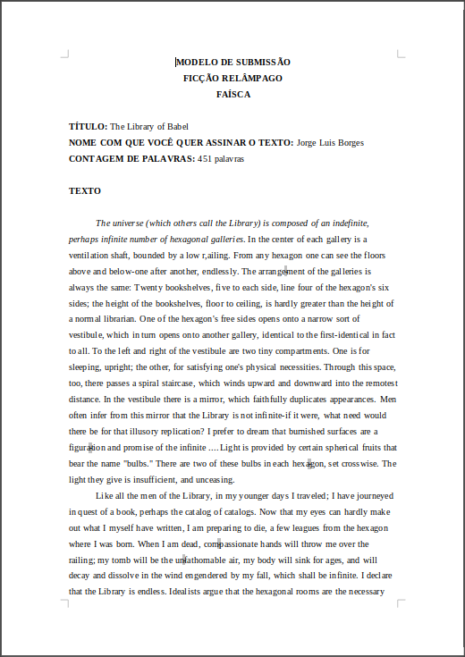
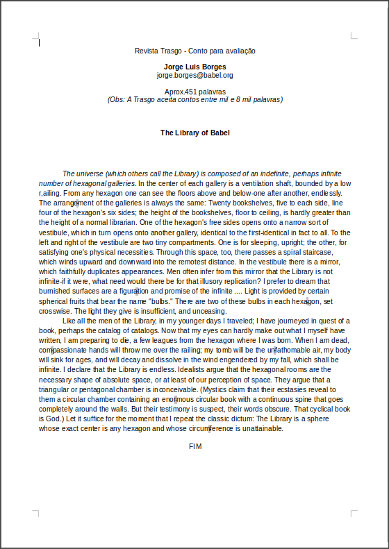
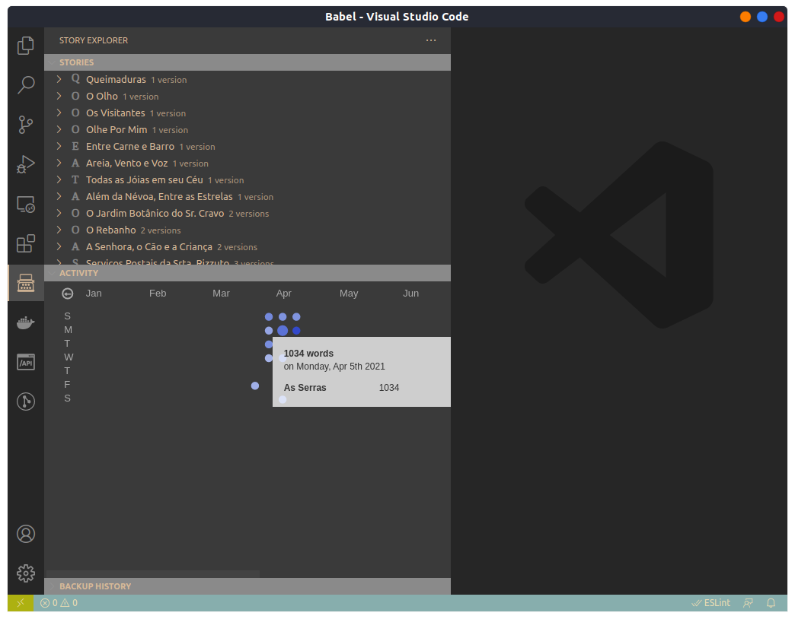

# Babel [](https://travis-ci.com/wmorellato/babel)

Babel is a Visual Studio Code extension for writers and developers. It helps you manage your pieces and write without distractions, focusing on what really matters: your story. Using *versions*, you can keep track of your drafts, revisions, translations and submissions on Babel view. Upcoming features include backups of your stories in cloud storage providers, language statistics, exporting to custom manuscript formats and integration with [The Grinder](https://thegrinder.diabolicalplots.com/).



## Usage

1. Install Babel.
2. Create a folder to store your stories.
3. Open this folder with VSCode (either using the context menu in your file system explorer or directly from VSCode).
4. Click Babel icon in the activity bar to active the extension. Babel will ask you if you want to use the current folder to hold your stories. Choose yes.
5. Create a new story. A *draft* version will be automatically created.
6. Start writing.

## Git-Based Versioning

Babel now supports **two versioning modes**:

- **Git-based versioning** (default if git is installed): Each story is a git repository, each version is a branch
- **File-based versioning** (fallback): Traditional approach with separate markdown files per version

### How Git Versioning Works

When you create a new story with git available:

1. A git repository is initialized in the story folder
2. The initial version is created as a branch (e.g., `draft1`)
3. Every save automatically stages changes
4. When staged changes exceed 2000 characters, an auto-commit is created
5. Switching versions checks out the corresponding branch
6. All git operations happen automatically in the background

### Benefits

- **Accurate word tracking**: Net words calculated from git diffs (additions - deletions)
- **Complete history**: Every change is tracked via git commits
- **Branch safety**: Visual indicators and confirmations prevent wrong-branch commits
- **Commit management**: Squash multiple daily commits into one to keep history clean

### Status Bar Features

When editing a git-based story, you'll see helpful indicators in the status bar:

#### Branch Match Indicator

Shows whether you're editing the correct git branch:

- `✓ draft1` with green background = On correct branch
- `⚠ draft1 (on draft2)` with red background = **Warning**: Editing wrong branch

#### Daily Word Count

Displays net words written today in real-time:

- `📝 Today: +350 words` = Positive progress
- `📝 Today: -50 words` = More deletions than additions
- `📝 Today: 0 words` = No changes yet today

The count includes all commits from today plus uncommitted changes.

#### Commit Squashing

When you have multiple commits from today, a squash button appears:

- `🔀 Squash commits (13)` = Click to squash 13 commits into one

**Auto-prompt on close**: If you have more than 3 commits when closing VSCode, you'll be prompted to squash them.

### Branch Safety Features

#### Save Confirmation

If you try to save while on the wrong branch, Babel will show a modal warning:

```
You are editing version "Draft 1" (draft1) but git is on branch "draft2".
There are uncommitted changes on draft2. Do you want to commit to draft2?

[Commit to draft2]  [Cancel]
```

Choose **Cancel** to prevent accidental commits to the wrong branch.

#### Auto-Commit on Transitions

To prevent data loss, Babel automatically commits staged changes when:

- Closing a document
- Switching to another version
- The staged changes represent actual work (word count > 0)

### Migration to Git

Existing file-based stories can be migrated to git using the migration script in `scripts/migrate-to-git.js`:

```bash
# Dry run (shows what would happen)
node scripts/migrate-to-git.js --dry-run

# Migrate all stories
node scripts/migrate-to-git.js

# Migrate specific story
node scripts/migrate-to-git.js --story-id <story-id>

# Skip backup creation
node scripts/migrate-to-git.js --no-backup
```

The script will:
1. Initialize a git repository for each story
2. Create branches for each version
3. Commit existing content
4. Update the database with git metadata
5. Create a backup before migration (unless `--no-backup`)

## Markdown Comments Feature

This extension now supports inline comments in markdown files, similar to Google Docs!

### Features

#### Add Comments
- Select any text in a markdown file
- Right-click and select "Add Comment" or press `Ctrl+Shift+M` (Mac: `Cmd+Shift+M`)
- Enter your comment in the input box
- The selected text will be tagged with `[a]`, `[b]`, `[c]`, etc.

#### View Comments
- Hover over any `[x]` tag to see the comment
- The hover popup shows:
  - The original selected text
  - The comment text
  - Edit and Delete buttons

#### Edit Comments
- Hover over a comment tag and click "Edit"
- Or place cursor on a tag and use the command palette: "Comments: Edit Comment"
- Update the comment text

#### Delete Comments
- Hover over a comment tag and click "Delete"
- Or place cursor on a tag and use the command palette: "Comments: Delete Comment"
- Confirm the deletion

#### Auto-cleanup
- Orphan tags (comments without inline references) are automatically removed when you save the file

### Comment Format

Comments follow the Google Docs export format:

```markdown
This is some text with a comment[a] and another one[b].

More text here.


[a]This is the first comment
>>This is some text with a comment

[b]This is the second comment
>>and another one
```

The `>>` prefix stores the originally selected text for reference.

### Example Usage

1. Open a markdown file
2. Select text: "He swirled his glass"
3. Right-click → "Add Comment"
4. Enter: "Great imagery!"
5. Result: "He swirled his glass[a]"

At the end of the document:
```
[a]Great imagery!
>>He swirled his glass
```

## Exporting

> Please, review the output .docx file to fix any badly formatted text and to insert missing information about yourself.

You can easily export your versions to one of the provided formats. To do so, search for the export button next to each version name (you need to hover your mouse over the version row in the Story Explorer).

The author's information from Babel's settings will be used to fill some of the fields in the output document.

### Italics

To include *italics* in the output document, use the default markdown syntax (\*italics*\).

### Paragraphs

To be able to correctly export the paragraphs, you need to separate paragraphs with a blank line. **This includes dialog lines**. Here's how an excerpt of *Lord of the Rings* should be formatted:

```
It was dark, and white stars were shining, when Frodo and his companions came at last to the Greenway-crossing and drew near the village. They came to the West-gate and found it shut, but at the door of the lodge beyond it, there was a man sitting. He jumped up and fetched a lantern and looked over the gate at them in surprise.

"What do you want, and where do you come from?' he asked gruffly"

"We are making for the inn here,' answered Frodo. 'We are journeying east and cannot go further tonight."
```

### Templates

Babel is able to export to the following formats:

- [Shunn's Manuscript Format](https://www.shunn.net/format/templates.html)
- [Revista Mafagafo Faísca Template](https://mafagaforevista.com.br/submissoesfaisca/)
- [Revista Trasgo Template](https://trasgo.com.br/envie-o-seu-material)

The output docx files for *The Library of Babel*, from Jorge Luis Borges, can be seen below.

Shuun                        | Mafagafo Faísca              | Trasgo
:---------------------------:|:----------------------------:|:----------------------------:
 | | 

## Backups

Babel now stores backups of your workspace to ensure that, in case shit happens, your stories will be safe. You can configure the period of backup creations (daily, weekly or monthly), where they should be stores in your local computer and, optionally, save them on Google Drive.

To enable Google Drive integration, you have to set the `stories.backup.cloudBackup.googleDrive` option in Settings, then restart VSCode to trigger the authentication/authorization routine. I use [OAuth2](https://developers.google.com/identity/protocols/oauth2) to access Google Drive API and perform the backups.

> TODO: The page displayed after successful authentication is terrible. I'll make it better someday.

> :warning: **Important** Babel does not ask or store your username and password to perform backups. We access Google API using an authentication token, which is stored in your workspace folder in the file `.token`. Also, the permissions requested by Babel to store backups only allow the extension to access Babel's own files; however, **don't share the token file with anyone**, unless you don't mind your stories being accessible to others.

### Activity History

Added a new view that displays how many words were written on each day, and for which stories. Using the new [Webview API](https://code.visualstudio.com/api/extension-guides/webview) and also the awesome [Calendar heatmap graph](https://github.com/g1eb/calendar-heatmap) library. Below is an example for this view.



**Git-based tracking**: For git-based stories, word counts are calculated using git diffs, providing accurate net word counts (additions minus deletions). This means rewrites and edits are properly reflected in your activity statistics.

## Technical Improvements

### VSCode Git Extension Optimization

Babel automatically configures VSCode workspace settings to prevent the built-in Git extension from monitoring all story repositories, which could cause performance issues with many stories:

- Sets `git.autoRepositoryDetection` to `'openEditors'`
- Adds file watcher exclusions for `.git` directories

These settings are configured automatically when Babel activates. This prevents listener leaks and reduces CPU usage when working with many git-based stories.

### Cleanup Utilities

A cleanup script is available to remove orphaned database entries:

```bash
# Dry run (shows what would be removed)
node scripts/cleanup-dangling.js --dry-run

# Remove orphaned entries
node scripts/cleanup-dangling.js

# Skip backup creation
node scripts/cleanup-dangling.js --no-backup
```

The script checks for:
- Stories with missing directories
- Versions with missing files or branches
- Activity entries for non-existent stories
- Creates a backup before making changes (unless `--no-backup`)

### Markdown metadata

You can insert Markdown metadata as a header on the top of each version file to use its values instead of the provided in settings. If a field used by the template is missing or its value is empty, then we try to get the value from settings.

To insert the header in a version file, right-click on the editor and click the option `Insert header`. You will be provided with a list of the available templates. The header will be generated based on the fields required by this template.

### Send to Kindle

Send stories to your Kindle device. Requires setting up email addresses. [Read this guide](https://www.amazon.co.uk/sendtokindle/email) on how to do this. Then set the appropriate settings variables defined below.

Also it requires [pandoc-templates](https://github.com/prosegrinder/pandoc-templates) to generate the file in Shunn's format. Clone the repo in your local machine and set the path in the `exporter.pandoc-templates` setting on vscode.

Bear in mind that sending documents by email is quite unreliable, and it may not arrive, but it has worked for me so far.

## Settings

- `stories.workspace.removeFiles`: if set, the extension will also remove files when removing a story or a version from the workspace. Set with care.
- `stories.authorInformation.usePenName`: if set, the "Pen name" configuration will be used when exporting stories.
- `stories.authorInformation.name`: author's name.
- `stories.authorInformation.penName`: author's pen name.
- `stories.authorInformation.email`: author's e-mail.
- `stories.authorInformation.country`: author's country.
- `backup.period`: period between backup operations.
- `backup.cloudBackup.googleDrive`: allow Google Drive integration.
- `backup.localBackup.path`: local path to store backup files.
- `exporter.pandoc-templates`: local path to pandoc-templates repo.
- `kindle.emailService`: email service provider to use when sending documents to your Kindle device. Currently, only Gmail and Yahoo are supported.
- `kindle.recipientEmail`: registered mail address that will receive the file.
- `kindle.senderEmail`: registered email address to send documents to your Kindle device.
- `kindle.senderPassword`: password of the registered email address to send documents to your Kindle device.
- `kindle.exportFormat`: export format to be used when sending documents to your Kindle device. Currently, only EPUB and DOCX are supported.
