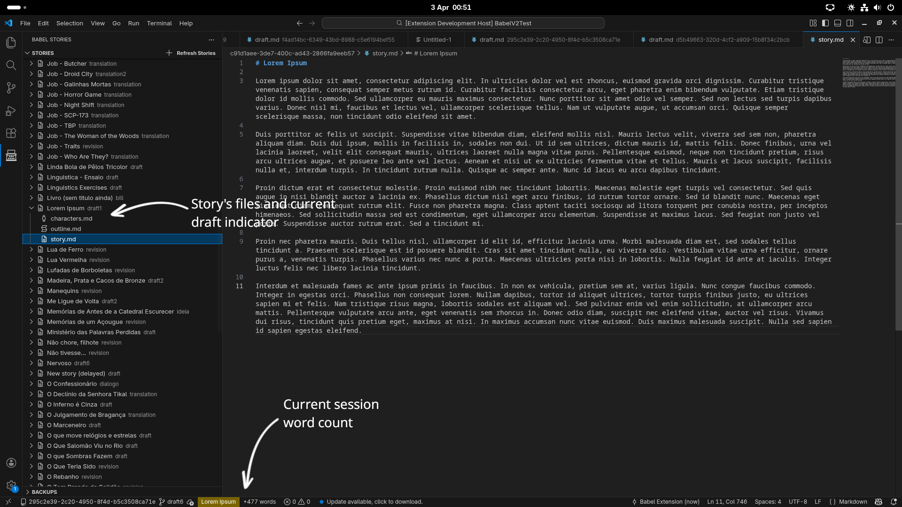
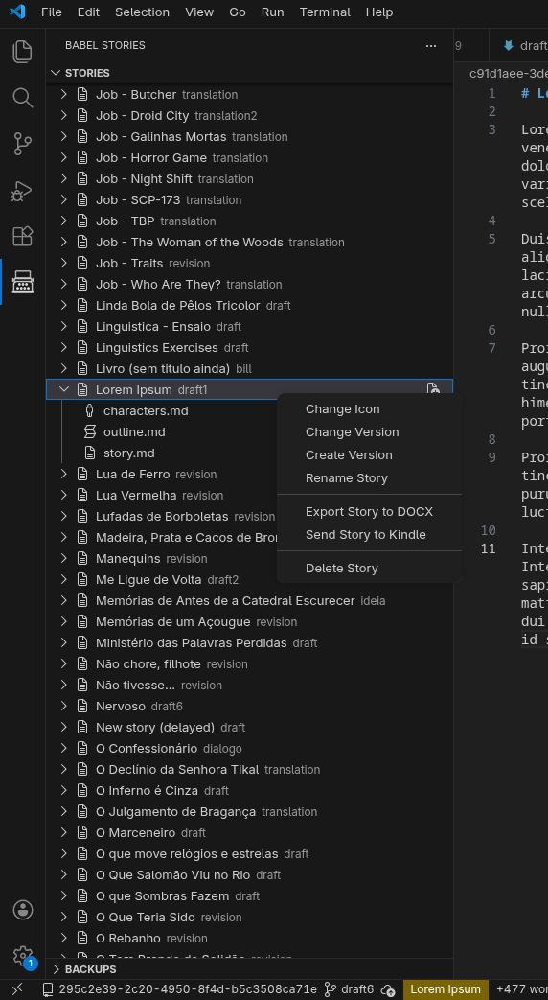
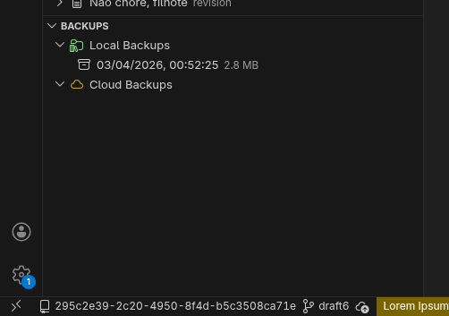
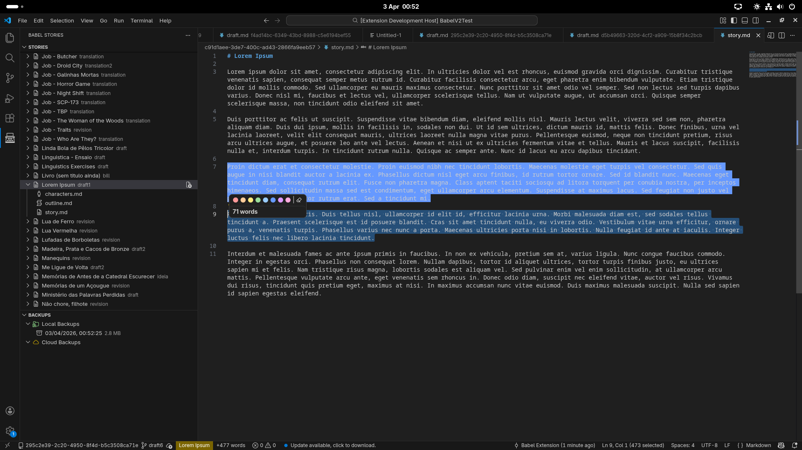

# Babel: Story Management for Writers

A filesystem-first VSCode extension that empowers writers to manage, version, and export their stories with Git-native versioning, automatic backups, and Kindle integration.

## Features

### Story Management

- **Multiple Story Types** - Create Short Stories, Novellas, Novels, and Essays with predefined configurations
- **Version Control** - Automatic Git versioning on every save with semantic version branching
- **Version Switching** - Switch between story versions with built-in conflict detection and resolution
- **Text Highlighting** - Color-code selected text passages for organization and editing (8 customizable colors)
- **Orphaned Branch Recovery** - Automatically recover deleted story versions

### Word Count & Analytics

- **Real-time Word Counts** - See word counts in status bar, hover tooltips, and tree view
- **Daily Tracking** - Track daily writing progress with automatic reset at midnight
- **Selection Analytics** - Check word counts of selected text instantly
- **Progress Monitoring** - Monitor cumulative word counts across multiple stories



### Export & Distribution

- **DOCX Export** - Export stories in industry-standard DOCX format for submissions and sharing
- **Manuscript Formatting** - Apply professional Shunn manuscript formatting with author metadata
- **Pandoc Integration** - Leverage pandoc with custom templates for high-quality exports
- **Author Metadata** - Configure author name, byline, address, email for export headers

### Send to Kindle

- **One-Click Publishing** - Send stories directly to Kindle devices via email
- **SMTP Support** - Compatible with Gmail and Yahoo email services
- **Secure Credentials** - Passwords stored securely using VSCode's native credential storage
- **Automatic Caching** - First-time password prompt, then automatic reuse
- **Size Validation** - Automatic 25MB file size check before sending
- **Inline Actions** - Quick action buttons directly in the story tree view



### Backup & Recovery

- **Automatic Backups** - Schedule backups hourly, daily, or weekly
- **Local Backups** - Store backups locally with configurable retention (1-365 days)
- **Cloud Backup** - Sync backups to Dropbox with OAuth2 authentication
- **Granular Control** - Enable/disable backup by provider independently
- **Restore Functionality** - Quickly restore from any backup snapshot
- **Auto-save Backups** - Create backups on every file save in addition to scheduled backups



## Installation

1. Install the Babel extension from the VSCode Extension Marketplace
2. Ensure you have Node.js 18+ installed
3. For DOCX export: Install [pandoc](https://pandoc.org/installing.html) and clone the [pandoc-templates](https://github.com/prosegrinder/pandoc-templates) repository locally

## Database Storage

Each Babel workspace maintains its own independent database stored at `.babel/babel.db` in the workspace root. This allows multiple workspaces to have isolated story data without conflicts.

The `.babel` directory is created automatically when the extension initializes. All story metadata, versions, word counts, and color annotations are stored in this local database.

## Getting Started

### First Launch

1. Open the Babel Stories panel from the activity bar (leftmost panel)
2. Click the **+** button to create your first story
3. Choose a story type: Short Story, Novella, Novel, or Essay
4. Start writing!

### Exporting a Story

1. Right-click a story in the Stories tree view
2. Click the **Export Story to DOCX** button or menu option
3. Choose export location
4. Your story is exported with professional formatting

### Sending to Kindle

#### Initial Setup

1. Go to VSCode Settings → Babel → Send to Kindle
2. Select your email service (Gmail or Yahoo)
3. Enter your sender email address
4. Enter your Kindle email address (usually `yourname@kindle.com`)
5. Right-click a story and select **Send Story to Kindle**
6. Enter your app-specific password when prompted (stored securely)

#### Subsequent Sends

1. Right-click the story
2. Click **Send Story to Kindle**
3. Your story is exported, validated, and sent automatically

**Important:** Use app-specific passwords, not your main account password:
- **Gmail**: Generate at [Google Account Security](https://myaccount.google.com/security)
- **Yahoo**: Generate at [Yahoo Account Security](https://login.yahoo.com/account/security)

### Highlighting Text

Writers can highlight important passages, dialogue, or sections for reference and editing:

1. Select text within your story editor
2. Use the Command Palette (`Cmd/Ctrl+Shift+P`) and search for "Babel: Apply [Color]"
3. Or right-click and select a color option
4. The text is highlighted with your chosen color
5. To remove highlighting, select the text and use "Babel: Remove Color"
6. **Important**: You have to save the file for the annotations to persist!

Custom colors can be adjusted in settings under `babel.colors.palette`.



### Managing Versions

1. Right-click a story in the tree view
2. **Create Version** - Start a new version branch
3. **Change Version** - Switch to a different version
4. **Delete Version** - Remove a version permanently

Babel automatically detects conflicts when switching versions and guides you through resolution.

### Configuring Backups

1. Open Babel Backups panel
2. Enable/disable Local Backup and Cloud Backup (Dropbox)
3. For Dropbox: Click **Authorize Dropbox** to connect your account
4. Customize backup schedule and retention in settings

## Configuration

All settings are available under **Settings → Babel** or in `settings.json`:

### Story & Export Settings

| Setting | Type | Default | Description |
|---------|------|---------|-------------|
| `babel.export.authorName` | string | *(empty)* | Author's full name for DOCX exports |
| `babel.export.authorByline` | string | *(empty)* | Author's byline/pen name |
| `babel.export.address` | string | *(empty)* | Street address for manuscript header |
| `babel.export.cityPostcode` | string | *(empty)* | City and postal code |
| `babel.export.phone` | string | *(empty)* | Phone number |
| `babel.export.email` | string | *(empty)* | Email address |
| `babel.export.pandocTemplatesPath` | string | *(empty)* | Path to pandoc-templates repository (required for exports) |

### Send to Kindle Settings

| Setting | Type | Options | Default | Description |
|---------|------|---------|---------|-------------|
| `babel.sendToKindle.emailService` | string | `gmail` `yahoo` | *(empty)* | Email provider for sending to Kindle |
| `babel.sendToKindle.senderEmail` | string | any email | *(empty)* | Email address that sends stories |
| `babel.sendToKindle.recipientEmail` | string | any email | *(empty)* | Kindle-enabled email to receive stories |

**Note:** Passwords are stored securely in the system credential manager and are never saved in settings.

### Backup Settings

| Setting | Type | Options | Default | Description |
|---------|------|---------|---------|-------------|
| `babel.backup.enabled` | boolean | true / false | `true` | Enable automatic backups |
| `babel.backup.schedule` | string | `disabled` `hourly` `daily` `weekly` | `daily` | Backup frequency |
| `babel.backup.time` | string | HH:mm (24h) | `02:00` | Time to run daily backup |
| `babel.backup.localPath` | string | file path | `${userHome}/.babel-backups` | Directory for local backups |
| `babel.backup.retention` | integer | 1-365 | `30` | Days to keep local backups |
| `babel.backup.autoSave` | boolean | true / false | `true` | Backup on every file save |
| `babel.backup.dropbox.enabled` | boolean | true / false | `false` | Enable Dropbox cloud backup |
| `babel.backup.dropbox.authorized` | boolean | true / false | `false` | OAuth2 authorization status *(auto-set)* |

### Color Customization

| Setting | Type | Default | Description |
|---------|------|---------|-------------|
| `babel.colors.palette` | object | See below | Custom color palette (hex values) |

Default palette:
```json
{
  "red": "#FF9999",
  "orange": "#FFCC99",
  "yellow": "#FFEA80",
  "green": "#99DD99",
  "cyan": "#99CCFF",
  "blue": "#6699FF",
  "purple": "#DD99FF",
  "pink": "#FFAADD"
}
```

## Commands

### Story Management

| Command | Title | Shortcut | Description |
|---------|-------|----------|-------------|
| `babel.newStory` | Babel: New Story | — | Create a new story |
| `babel.renameStory` | Babel: Rename Story | — | Rename the current story |
| `babel.deleteStory` | Delete Story | — | Delete a story permanently |
| `babel.changeIcon` | Change Icon | — | Change the story's icon |
| `babel.refreshStories` | Refresh Stories | — | Refresh the story tree view |

### Version Management

| Command | Title | Shortcut | Description |
|---------|-------|----------|-------------|
| `babel.newVersion` | Babel: New Version | — | Create a new version of the current story |
| `babel.switchVersion` | Babel: Switch Version | — | Switch to a different version |
| `babel.deleteVersion` | Babel: Delete Version | — | Delete a version permanently |

### Export & Distribution

| Command | Title | Shortcut | Description |
|---------|-------|----------|-------------|
| `babel.exportStory` | Export Story to DOCX | — | Export current story to DOCX format |
| `babel.sendToKindle` | Send Story to Kindle | — | Send current story to Kindle device |

### Activity & Analytics

| Command | Title | Shortcut | Description |
|---------|-------|----------|-------------|
| `babel.viewActivity` | Babel: View Activity | — | View story activity history |

### Backup Management

| Command | Title | Shortcut | Description |
|---------|-------|----------|-------------|
| `babel.backupNow` | Babel: Backup Now | — | Trigger immediate backup |
| `babel.restoreBackup` | Babel: Restore Backup | — | Restore from a backup |
| `babel.deleteBackup` | Babel: Delete Backup | — | Delete a backup file |
| `babel.toggleLocalBackup` | Babel: Toggle Local Backup | — | Enable/disable local backups |
| `babel.toggleCloudBackup` | Babel: Toggle Cloud Backup | — | Enable/disable cloud backups |
| `babel.authorizeDropbox` | Babel: Authorize Dropbox | — | Authorize Dropbox for cloud backup |
| `babel.revokeDropboxToken` | Babel: Revoke Dropbox Token | — | Disconnect Dropbox access |
| `babel.openBackupFolder` | Babel: Open Backup Folder | — | Open local backup directory |
| `babel.enableBackup` | Babel: Enable Backup | — | Enable backup provider |
| `babel.disableBackup` | Babel: Disable Backup | — | Disable backup provider |

### Migration (v1 → v2)

| Command | Title | Shortcut | Description |
|---------|-------|----------|-------------|
| `babel.migrate` | Babel: Migrate from v1 to v2 | — | Manually trigger migration from Babel v1 to v2 |

### Text Highlighting

| Command | Title | Description |
|---------|-------|-------------|
| `babel.applyColor.red` | Babel: Apply Red Color | Highlight selected text red |
| `babel.applyColor.orange` | Babel: Apply Orange Color | Highlight selected text orange |
| `babel.applyColor.yellow` | Babel: Apply Yellow Color | Highlight selected text yellow |
| `babel.applyColor.green` | Babel: Apply Green Color | Highlight selected text green |
| `babel.applyColor.cyan` | Babel: Apply Cyan Color | Highlight selected text cyan |
| `babel.applyColor.blue` | Babel: Apply Blue Color | Highlight selected text blue |
| `babel.applyColor.purple` | Babel: Apply Purple Color | Highlight selected text purple |
| `babel.applyColor.pink` | Babel: Apply Pink Color | Highlight selected text pink |
| `babel.removeColor` | Babel: Remove Color | Remove color highlight from selection |

## Security

### Credential Storage

Babel uses VSCode's native credential storage system, which encrypts sensitive data using your operating system's credential manager:

- **macOS**: Keychain
- **Windows**: Windows Credential Manager
- **Linux**: Secret Service (or pass if available)

Email passwords are never stored in plain text or VSCode settings.

### Best Practices

1. **Use App-Specific Passwords** - Never use your main account password
2. **Revoke Access** - Revoke Kindle sending permissions if you stop using the feature
3. **Secure Your Computer** - Your VSCode credential manager is only as secure as your login

## Troubleshooting

### Export Fails: "Pandoc not found"

**Solution:** Install pandoc and set `babel.export.pandocTemplatesPath` to your pandoc-templates directory:

1. Install pandoc: https://pandoc.org/installing.html
2. Clone templates: `git clone https://github.com/prosegrinder/pandoc-templates.git /path/to/templates`
3. Set path in VSCode Settings

### Send to Kindle Fails: "Invalid email"

**Solution:** Verify your email configuration:
- Check `babel.sendToKindle.senderEmail` is a valid email
- Check `babel.sendToKindle.recipientEmail` is your Kindle-enabled email (usually `yourname@kindle.com`)
- Ensure you're using an app-specific password, not your main account password

### Send to Kindle Fails: "File too large"

**Solution:** The file exceeds the 25MB Kindle email limit. Check your DOCX size and consider shortening the story.

### Version Switch Fails: "Conflict detected"

**Solution:** You have uncommitted changes. Either:
1. Commit your changes first: Use `git add .` and `git commit` in the terminal
2. Discard changes: Close the file without saving
3. Let Babel guide you through conflict resolution

## Upgrading from Babel v1 to v2

Babel v1 used a JSON-based database (`babel.json`) with each story having one branch per file. Babel v2 uses SQLite (`.babel/babel.db`) where stories have one branch per version.

### Automatic Migration

When you upgrade to Babel v2 with an existing v1 workspace:

1. **On Extension Startup** - The extension automatically detects v1 data (`babel.json`)
2. **Migration Dialog** - You'll see: "Found Babel v1 data. Migrate to v2?"
3. **Choose Your Path**:
   - **Migrate Now** → Start the automated migration (recommended)
   - **Use v1** → Keep using v1 (you can migrate later).

> :warning: If you choose to stay with v1, you'll have to downgrade Babel to a 1.x version in the marketplace.

### How Migration Works

**Phase 1: Backup**
- All v1 files (babel.json + story folders) are **moved** to `.babel/backups/babel-backup-<timestamp>/`
- This is a move operation, not a copy - v1 data is archived for safety

**Phase 2: Validate**
- V1 data is scanned and a migration plan is created
- You see a preview of what will be created

**Phase 3: Review**
- Preview file is generated at `.babel/migration-preview.md`
- Review exactly what will happen before proceeding

**Phase 4: Execute**
- **Phase A** - Non-standard versions (custom files like "I", "II", "outline", etc.) are migrated as files on the `draft` branch
- **Phase B** - Standard versions (draft, revision, translation) are migrated as separate git branches
- Each story gets its own git repository in the workspace root

**Phase 5: Report**
- Migration results are saved to `.babel/migration-report-<timestamp>.md`
- Summary shows: stories created, skipped, failed

### Manual Migration Command

If you dismiss the automatic migration dialog, you can trigger it manually:

1. Open Command Palette: `Ctrl+Shift+P` (Windows/Linux) or `Cmd+Shift+P` (macOS)
2. Search for: **"Babel: Migrate from v1 to v2"**
3. Follow the same flow as automatic migration

### Files to Check After Migration

```
workspace/
├── .babel/
│   ├── babel.db                      ← New v2 database (SQLite)
│   ├── migration-preview-<ts>.md     ← What was migrated
│   ├── migration-report-<ts>.md      ← Results of migration
│   └── backups/
│       └── babel-backup-<ts>/        ← Your archived v1 data
│           ├── babel.json            ← Original v1 config
│           ├── story-1/              ← Original v1 story folders
│           └── story-2/
├── story-1/                          ← New v2 story repos
│   ├── .git/
│   ├── draft/                        ← Git branch
│   ├── translation/                  ← Git branch (if exists in v1)
│   └── draft.md
└── story-2/
    ├── .git/
    ├── draft/
    └── draft.md
```

### What If Something Goes Wrong?

#### Migration Fails or Errors Occur

1. **During migration**: The progress bar shows which phase failed
2. **Error dialog appears**: You get options:
   - **Retry** - Try migration again
   - **Keep v2 as-is** - Continue with partial migration (not recommended)
   - **Rollback to v1** - Restore v1 data from backup

#### Error: "Cannot read property X of undefined"

**Solution:**
1. Check the migration report: `.babel/migration-report-<timestamp>.md`
2. See which stories failed and why
3. Manually migrate failed stories or contact support

#### Error: Stories not appearing after migration

**Solution:**
1. Verify v2 repos exist: `ls -la` in workspace root
2. Check database exists: `ls -la .babel/babel.db`
3. Refresh Babel Stories view: Use **Babel: Refresh Stories** command
4. If still missing, restore from backup (see below)

#### Manual Rollback: Restore from Backup

If migration succeeded but you want to go back to v1:

1. **Restore v1 data:**
   ```bash
   # Find your backup
   ls -la .babel/backups/

   # Move v1 files back to workspace root
   mv .babel/backups/babel-backup-2026-04-03-120000/* ./
   mv .babel/backups/babel-backup-2026-04-03-120000/.* ./  # Move hidden files too
   ```

2. **Delete v2 database:**
   ```bash
   rm .babel/babel.db
   ```

3. **Restart VSCode**
   - The extension will detect `babel.json` and show the migration dialog again

### Clean Up After Successful Migration

Once you've verified all stories migrated correctly:

1. **Keep the backup** - It's a safety archive (optional: delete after 1-2 weeks)
   ```bash
   rm -rf .babel/backups/babel-backup-<timestamp>/
   ```

2. **Remove migration files** (optional - they're just documentation)
   ```bash
   rm .babel/migration-preview-*.md
   rm .babel/migration-report-*.md
   ```

3. **Verify v2 is working** - Create a new story, edit, switch versions
   - Check `.babel/babel.db` exists
   - Check story folders have `.git/` directories
   - Check word counts and other features work

### Migration FAQ

**Q: Will my story content be lost?**  
A: No. Content is copied from v1 branches into v2 git repos. Backups are kept.

**Q: Can I undo the migration?**  
A: Yes. See "Manual Rollback" section above.

**Q: How long does migration take?**  
A: Depends on story count. Usually 10-30 seconds. Large workspaces (100+ stories) may take 1-2 minutes.

**Q: What if I have custom story branches?**  
A: Non-standard versions (custom names) become files in the `draft` branch. Standard versions (draft, revision, translation) get their own branches.

**Q: Can I migrate individual stories?**  
A: Currently, all-or-nothing. Partial migration not yet supported. Use manual restore if you need to retry.

## Contributing

Babel is open source. Contributions are welcome! Please submit issues and pull requests on GitHub.

## License

MIT License - See LICENSE file for details

## Support

For issues, questions, or feature requests, visit the [Babel GitHub repository](https://github.com/yourusername/babel).

---

**Happy writing! ✍️**
